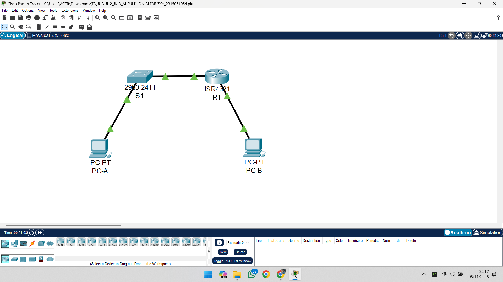
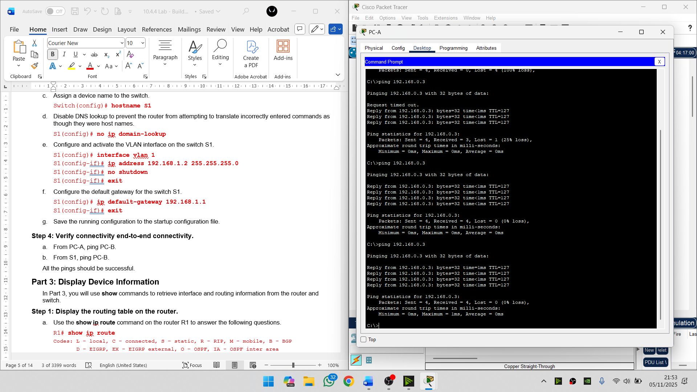
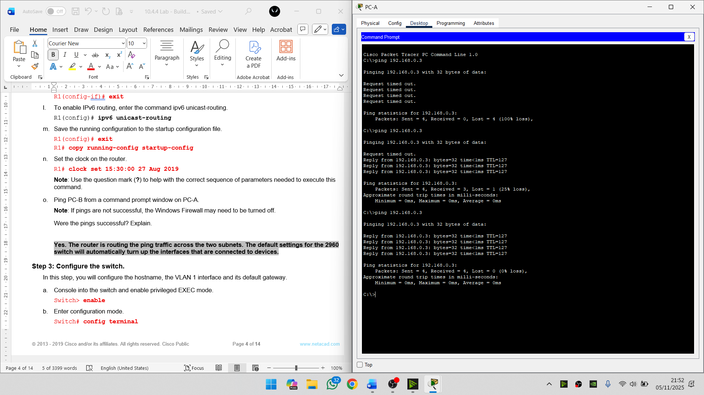
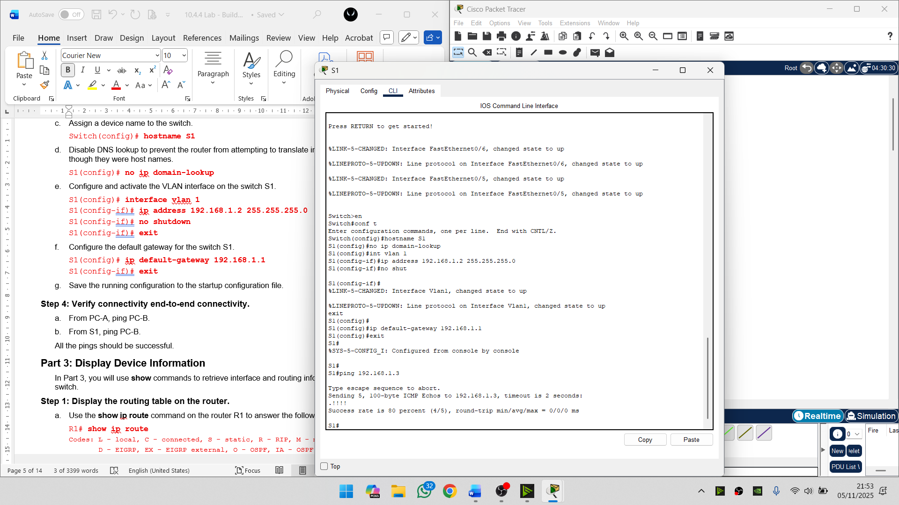
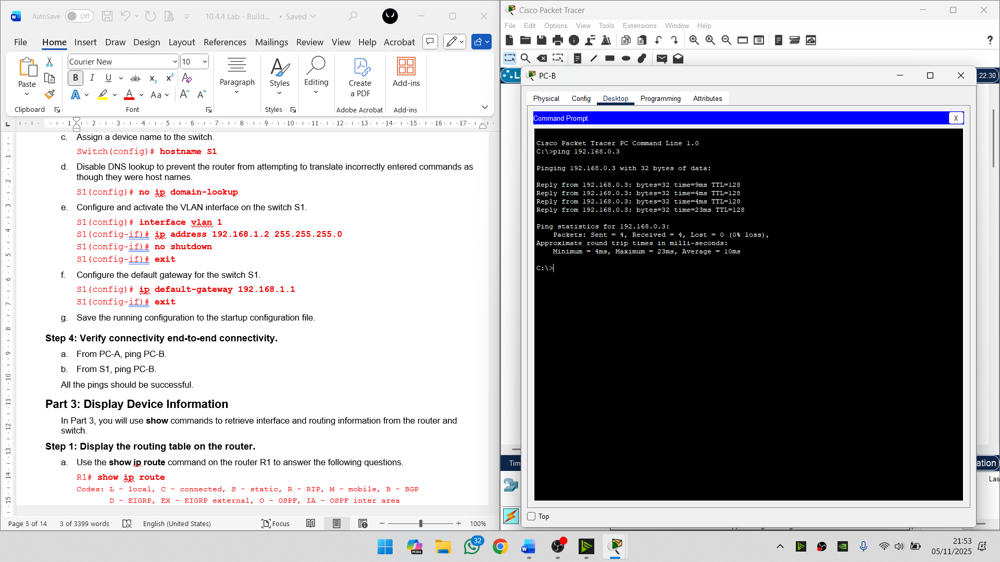

# 🧩 Tugas Akhir Praktikum Jaringan Komputer Judul 2
## **10.4.4 Lab - Build a Switch and Router Network**

---

### 🎥 Video Penjelasan:

**[Klik di sini untuk menonton di YouTube](https://youtu.be/At95s4uAG6M)**

---

### 📘 Deskripsi Singkat
Proyek ini merupakan implementasi dari **Lab 10.4.4 – Build a Switch and Router Network** menggunakan **Cisco Packet Tracer**.  
Tujuannya adalah membangun jaringan sederhana antara dua LAN yang dihubungkan dengan router, lalu mengonfigurasinya menggunakan **IPv4 dan IPv6** hingga semua perangkat dapat saling terhubung.

---

### 🏗️ Topologi Jaringan
[PC-A] ── [Switch S1] ── [Router R1] ── [PC-B]

| Device | Interface | IP Address | Gateway |
|---------|------------|-------------|-----------|
| R1 | G0/0/0 | 192.168.0.1 /24 | - |
| R1 | G0/0/1 | 192.168.1.1 /24 | - |
| S1 | VLAN 1 | 192.168.1.2 /24 | 192.168.1.1 |
| PC-A | NIC | 192.168.1.3 /24 | 192.168.1.1 |
| PC-B | NIC | 192.168.0.3 /24 | 192.168.0.1 |

---

### ⚙️ Konfigurasi Singkat

**Router R1**

enable

conf t

hostname R1

no ip domain-lookup

enable secret class

banner motd $ Authorized Users Only! $

interface g0/0/0

 ip address 192.168.0.1 255.255.255.0

 no shutdown

interface g0/0/1

 ip address 192.168.1.1 255.255.255.0

 no shutdown

ipv6 unicast-routing

exit

copy run start

**Switch S1**

enable

conf t

hostname S1

no ip domain-lookup

interface vlan 1

ip address 192.168.1.2 255.255.255.0
 
no shutdown

ip default-gateway 192.168.1.1

copy run start

---

### 🔍 Verifikasi
Dari PC-A lakukan ping 192.168.0.3

✅ Jika berhasil, berarti konfigurasi router dan switch sudah benar.

Gunakan perintah:

R1# show ip route

R1# show ip interface brief

---

### 📸 Dokumentasi

**🖥️ Topologi Packet Tracer**  

**📶 Hasil Ping Gagal**  

**📶 Hasil Ping Berhasil**  

**📶 Hasil Ping Switch**  

**📶 Hasil Ping PC B**  

---

### 💡 Kesimpulan

Router berhasil menghubungkan dua subnet yang berbeda.

Switch berfungsi dengan baik sebagai penghubung antar host.

Semua perangkat dapat berkomunikasi melalui ping.

---

### 👨‍💻 Identitas
Nama: M Sulthon Alfarizky

NPM: 2315061054

Kelas: PJK A
